# DIU21
Prácticas Diseño Interfaces de Usuario 2020-21 (Tema: Turismo) 

Grupo: DIU3_LosArtistas.  Curso: 2020/21 
Updated: 12/5/2021

Proyecto:

***GranadaÁrabe***

Descripción:

La app ***GranadaÁrabe*** propone al usuario un conjunto de lugares y experiencias: gastronómicas, monumentales, actividades y paseos relacionados con la historia árabe que rodea a Granada.

El usuario podrá seleccionar el tiempo del que dispone para pasar en la ciudad y el tipo de experiencias que le gustaría vivir y disfrutar. En función de su selección, la app proporcionará una serie de rutas que al usuario podrían interesar, entre las cuales podrá elegir.

Logotipo:

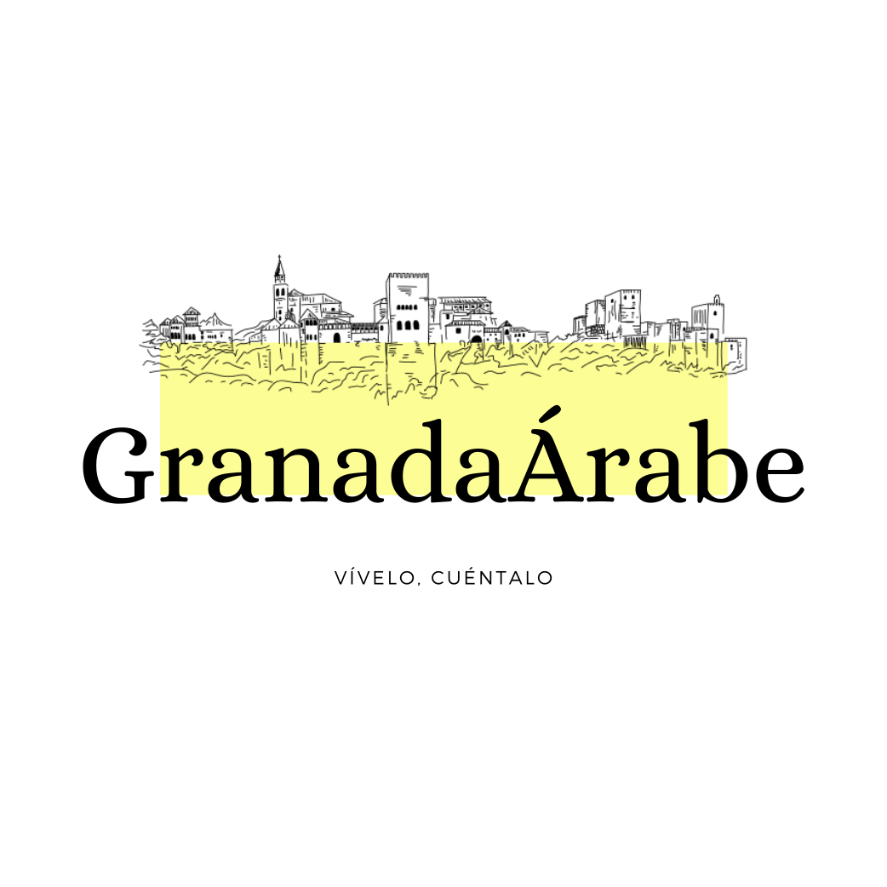

Miembros
 * :bust_in_silhouette:   Ramón García Verjaga  
 * :bust_in_silhouette:   Daniel Haro Contreras

# Proceso de Diseño 

## Paso 1. UX Desk Research & Analisis 

 1.a Competitive Analysis
-----

 En relación a la asignación **DIU3 Experiencias y planificación de ocio**, hemos elegido los siguientes cuatro competidores que compararemos atendiendo a diferentes factores; entre ellos, la experiencia de usuario en los más diversos y frecuentes micro-momentos que pueden tener los usuarios en sus aventuras por las plataformas.
 - [Civitatis](https://www.civitatis.com/es/ "Civitatis"): Está centrada exclusivamente en las experiencias y planificación de ocio. Permite consultar y reservar diferentes experiencias en los lugares más turísticos del planeta. Es muy reconocida a nivel internacional y sirve de guía para muchos turistas ofreciendo diferentes itinerarios de visita en función de las necesidades de los mismos.
 - [TripAdvisor](https://www.tripadvisor.es/ "TripAdvisor"): No está centrada exclusivamente en las experiencias y planificación de ocio. Permite buscar alojamientos, restaurantes, vuelos, etc. Además, destaca por la comunidad tan grande que posee, que la hace una plataforma repleta de opiniones e hilos en foros que permiten encontrar casi cualquier opinión sobre diferentes restaurantes, hoteles, actividades, etc.
 - [Airbnb](https://www.airbnb.es/ "Airbnb"):  Está centrada principalmente en el alojamiento, razón por la que se expandió en sus comienzos. Sin embargo, ofrece tanto experiencias presenciales como experiencias online. Estas últimas surgen debido a la pandemia de COVID-19 con un aire renovador de adaptación. Se posiciona como la única plataforma en ofrecer experiencias online.
 - [Agenda cultural Junta de Andalucía](https://www.juntadeandalucia.es/cultura/agendaculturaldeandalucia/ "Agenda cultural Junta de Andalucía"): Está centrada exclusivamente en las experiencias y planificación de ocio. Permite conocer la mayor parte de los eventos culturales de Andalucía. Está dedicada a poner en valor el ocio regional y rural.

 Tabla de análisis comparativo que refleja algunas de las que hemos considerado principales características de las diferentes plataformas elegidas:

| | [Civitatis](https://www.civitatis.com/es/ "Civitatis") | [TripAdvisor](https://www.tripadvisor.es/ "TripAdvisor") | [Airbnb](https://www.airbnb.es/ "Airbnb") | [Agenda cultural Junta de Andalucía](https://www.juntadeandalucia.es/cultura/agendaculturaldeandalucia/ "Agenda cultural Junta de Andalucía") |
| ---- | ---- | ---- | ---- | ---- |
| Permite publicar experiencias | :heavy_check_mark: De forma comercial | :heavy_check_mark: De forma comercial | :heavy_check_mark: De forma comercial | :heavy_check_mark: De forma particular e institucional |
| Ofrece experiencias gratuitas | :heavy_check_mark: | :x: | :x: | :heavy_check_mark: |
| Ofrece experiencias en diversidad de sitios, no solo en los más turísticos | :x: | :x: | :x: | :heavy_check_mark: |
| Ofrece experiencias online | :x: | :x: | :heavy_check_mark: | :x: |
| Permite buscar experiencias | :heavy_check_mark: | :heavy_check_mark: | :heavy_check_mark: | :heavy_check_mark: |
| Permite filtrar experiencias por lugar | :heavy_check_mark: | :heavy_check_mark: | :heavy_check_mark: | :heavy_check_mark: |
| Permite filtrar experiencias por fecha | :heavy_check_mark: | :heavy_check_mark: | :heavy_check_mark: | :heavy_check_mark: |
| Permite filtrar experiencias por precio | :heavy_check_mark: | :heavy_check_mark: | :x: | :x: |
| Permite filtrar experiencias por accesibilidad | :heavy_check_mark: | :x: | :x: | :x: |
| Permite realizar la reserva de la experiencia | :heavy_check_mark: | :heavy_check_mark: | :heavy_check_mark: | :x: |
| Permite gestionar la reserva sin estar registrado | :heavy_check_mark: | :x: | :x: | :heavy_minus_sign: No procede |
| Permite que los usuarios publiquen opiniones sobre la experiencia | :heavy_check_mark: | :heavy_check_mark: | :heavy_check_mark: | :x: |
| Proporciona información sobre las restricciones por coronavirus en las experiencias | :heavy_check_mark: Mensaje genérico | :heavy_check_mark: Mensaje adaptado a cada experiencia | :x: | :heavy_check_mark: Depende del publicador de la experiencia |

 La plataforma que hemos elegido es [Civitatis](https://www.civitatis.com/es/ "Civitatis") por los siguientes motivos: es la plataforma que más se adapta a nuestro objetivo en los aspectos que hemos considerado importantes; ocupa la mayor cuota de mercado, es decir, es la más extendida entre los clientes; y tiene capacidad de adaptarse para cubrir experiencias que, a día de hoy, no cubre como, por ejemplo, experiencias y actividades en zonas no tan populares.

 1.b Persona
-----

 ## Roberto
 ### ¿Por qué hemos seleccionado a Roberto?
 Hemos seleccionado a Roberto por varios motivos:
 - No está familiarizado con las nuevas tecnologías.
 - Puede encontrar algunas dificultades a la hora de utilizar la plataforma.
 - Está interesado en aprender y vivir nuevas experiencias.

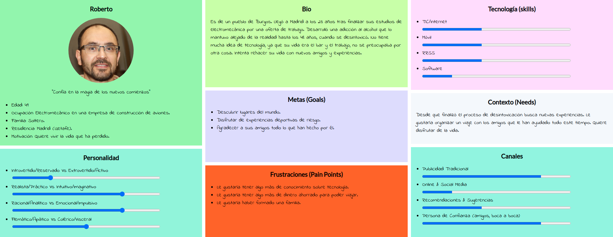

 ## Ana
 ### ¿Por qué hemos seleccionado a Ana?
 Hemos seleccionado a Ana por varios motivos:
 - Está acostumbrada a las nuevas tecnologías.
 - Sus exigencias en materia de interfaz de usuario son altas. Si no es lo suficientemente intuitiva, muy probablemente tardará poco en salirse del servicio.
 - En ella es muy importante la fase de “Soñar”: se le tiene que notificar debidamente de los posibles eventos de su gusto.

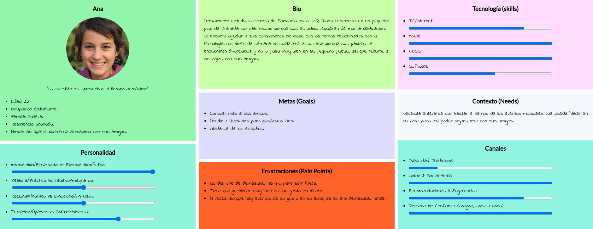

Por lo anterior, hemos llegado a la conclusión de que Roberto y Ana son usuarios que pueden aportarnos gran valor a la hora de realizar el análisis de la experiencia de usuario de la plataforma seleccionada.

 1.c User Journey Map
----

###  Journey Map de Roberto

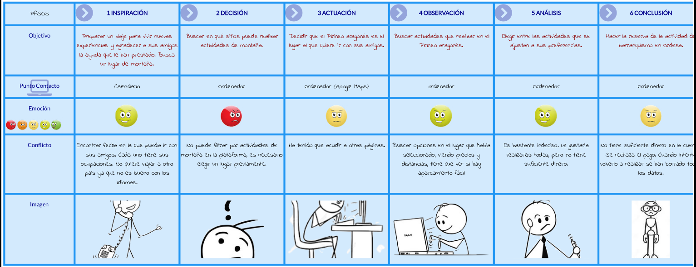

###  Journey Map de Ana

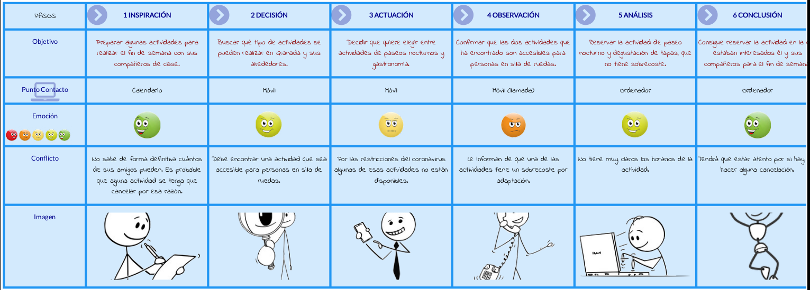

Hemos elegido estas dos experiencias de usuario porque representan fielmente situaciones que ocurren frecuentemente a diferentes prototipos de personas. En nuestro caso los prototipos: *Roberto*, que no está muy familiarizado con la tecnología, encuentra ciertos problemas tanto a la hora de realizar la búsqueda de actividades como a la hora de realizar la reserva; por su parte, *Ana*, se frustra porque no encuentra información específica sobre accesibilidad para cada actividad.

 1.d Usability Review
----

Enlaces a las valoraciones de usabilidad (Usability Reviews):

:link: [Civitatis-Usability-Review.pdf](P1/Civitatis-Usability-Review.pdf)

:link: [Civitatis-Usability-Review.xlsx](P1/Civitatis-Usability-Review.xlsx)

### Valoración final y conclusión

🥈 Valoración final (numérica): **79** - **Good**

Los pocos fallos que tiene la página no impiden que, en general, la experiencia de uso sea buena. Se incluyen las características de las páginas web actuales como diseño responsive, buena visualización y apariencia, un diseño muy sencillo sin demasiada información y tiempos de respuesta inapreciables. Los usuarios poco experimentados tendrán seguramente una buena experiencia, mientras que los más experimentados, además, notarán que la buena apariencia y simplicidad de la página les invita a quedarse más tiempo.

## Paso 2. UX Design  

GranadaÁrabe ofrece a los usuarios una solución gratuita, barata y de calidad para planear sus rutas árabes en la provincia de Granada. Permite conocer la Granada de los musulmanes de forma entretenida, sin perder tiempo y de la manera más local posible, armonizando la cultura y las tradiciones con rutas para todos los gustos.

 2.a Feedback Capture Grid / Empathy map / POV
----

### Empathy map
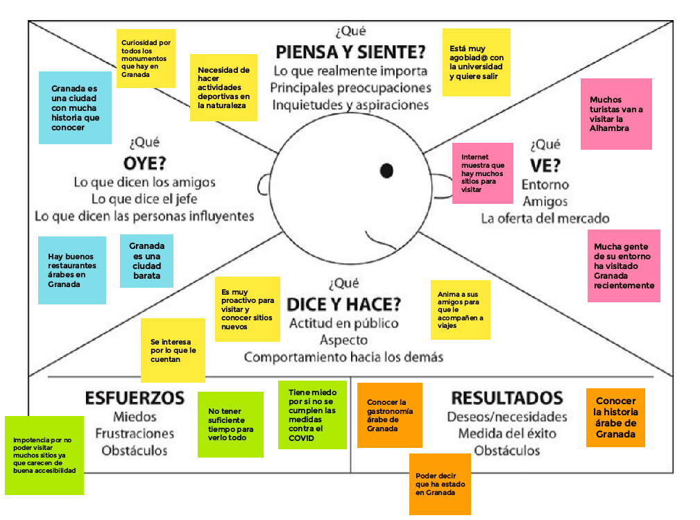

 2.b ScopeCanvas
----

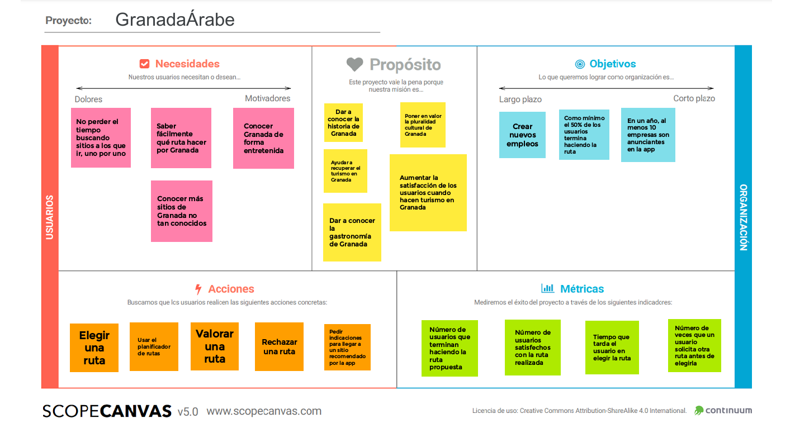

 2.b Tasks analysis 
-----

### Matriz de tareas/usuarios

| **Tareas / Grupos de usuarios**          | *Usuario que quiere hacer una ruta* | *Comerciante de Granada* | *Institución o artista granadino* |
|:-----------------------------|:-----------------------------------:|:------------------------:|:---------------------------------:|
| Pedir recomendación de ruta | H                                 | L                      | L                               |
| Elegir ruta                 | M                                 | L                      | L                               |
| Iniciar ruta                | M                                 | L                      | L                               |
| Rechazar ruta               | L                                 | L                      | L                               |
| Valorar lugar de interés    | M                                 | L                      | L                               |
| Valorar ruta                | L                                 | L                      | L                               |
| Publicar anuncio            | L                                 | H                      | H                               |
| Publicar actividad          | L                                 | H                      | H                               |

 2.c IA: Sitemap + Labelling 
----

### Sitemap
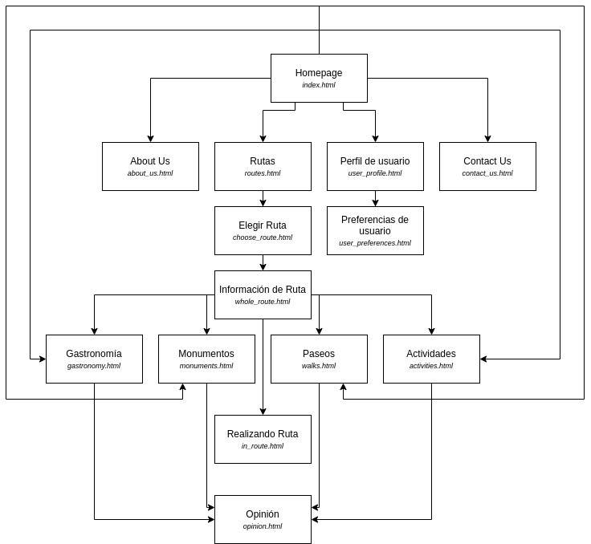

### Labelling
|          Término          |                                             Significado                                            |
|-----------------------|-------------------------------------------------------------------------------------------------|
| Sobre nosotros (About Us) | Información de la empresa y del objetivo de la aplicación                                         |
| Contáctanos (Contact Us) | Información de contacto de la empresa                                                             |
| Gastronomía (Gastronomy) | Experiencias gastronómicas anunciadas en la aplicación                                            |
| Monumentos (Monuments) | Experiencias de visitas de monumentos anunciadas en la aplicación                                 |
| Paseos (Walks) | Experiencias de paseos anunciadas en la aplicación                                                |
| Actividades (Activities) | Experiencias de actividades anunciadas en la aplicación                                           |
| Rutas (Routes) | Itinerarios con diferentes experiencias                                                           |
| Buscar ruta (Search route) | Buscar ruta en base a las preferencias de fechas y experiencia elegidas                           |
| Elegir ruta (Take route) | Elegir ruta entre las propuestas                                                                  |
| Información de ruta (Route information) | Información sobre la ruta propuesta o elegida                                                     |
| Comenzar ruta (Start route) | Comenzar la ruta elegida para su seguimiento desde la aplicación en tiempo real                   |
| Realizando ruta (In route) | Información de la ruta durante su realización                                                     |
| Opinión (Opinion) | Valorar y comentar la ruta realizada                                                              |
| Buscar (Search) | Buscar rutas y experiencias en la aplicación                                                      |
| Iniciar sesión (Login) | Acceder a la aplicación                                                                           |
| Registrarse (Register) | Registrarse en la aplicación                                                                      |
| Perfil de usuario (User profile) | Lugar donde se pueden ver los datos y las distintas rutas y reservas de un usuario                |
| Preferencias de usuario (User preferences) | Lugar donde se pueden modificar determinados aspectos de la configuración de un perfil de usuario |

 2.d Wireframes
-----

### Página principal (index.html)
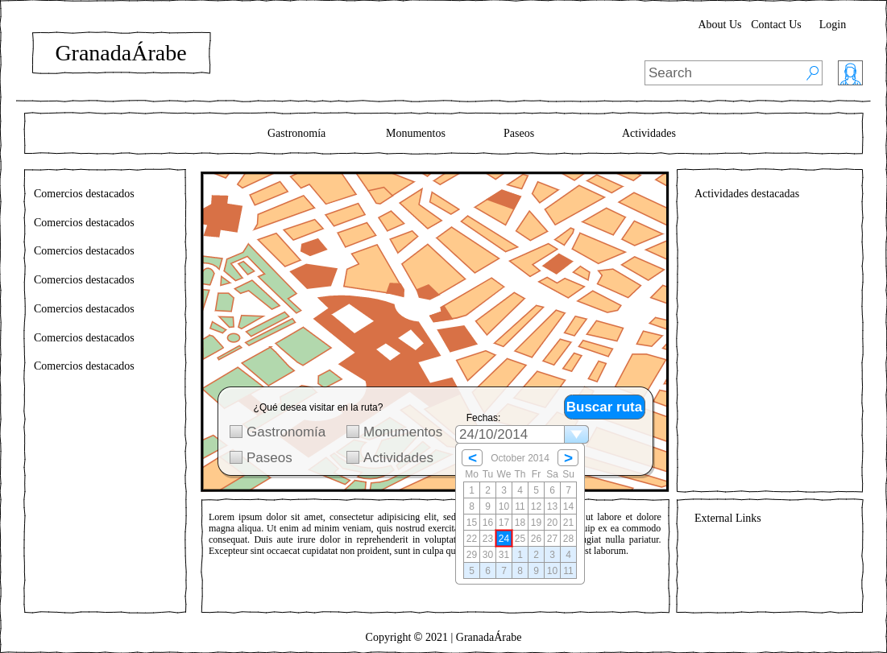

### Página de tipo de experiencia (gastronomy.html)
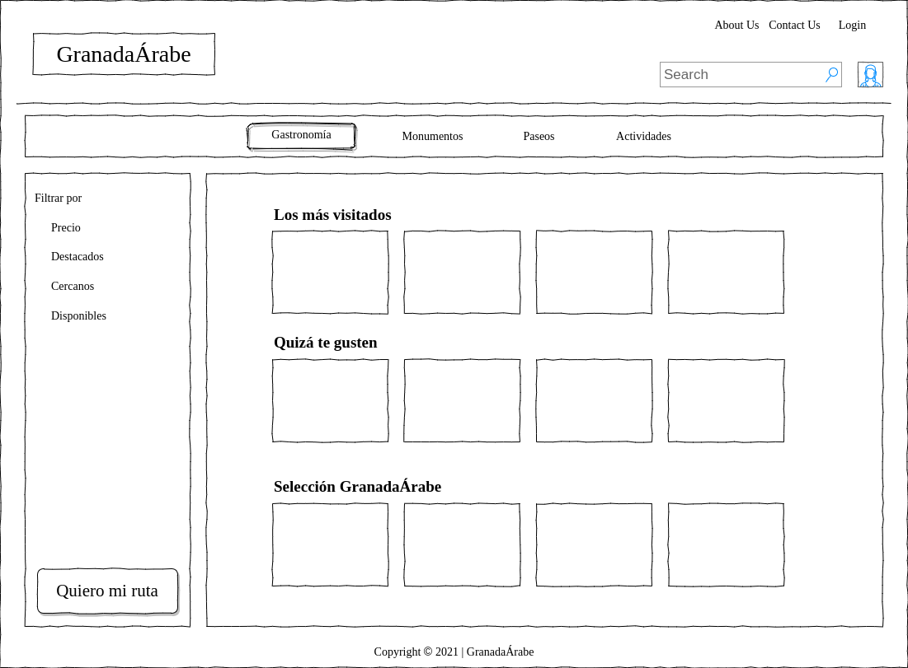

### Página de ruta (route.html)
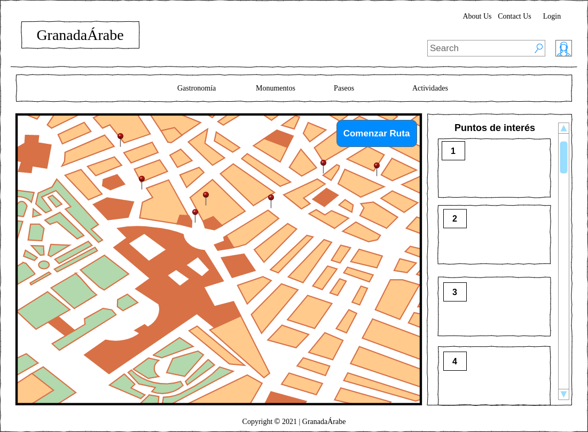

## Paso 3. Mi UX-Case Study (diseño)

 3.a Moodboard
-----

### Moodboard
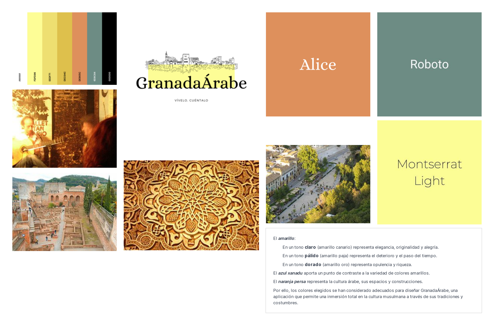

### Logotipo

>>> Plantear Diseño visual con una guía de estilos visual (moodboard) 
>>> Incluir Logotipo
>>> Si diseña un logotipo, explique la herramienta utilizada y la resolución empleada. ¿Puede usar esta imagen como cabecera de Twitter, por ejemplo, o necesita otra?

  3.b Landing Page
----

### Página 1
#### Información multimedia relevante para captar la atención de los usuarios

### Página 2
#### Explicación del valor y la importancia de la oferta para los usuarios
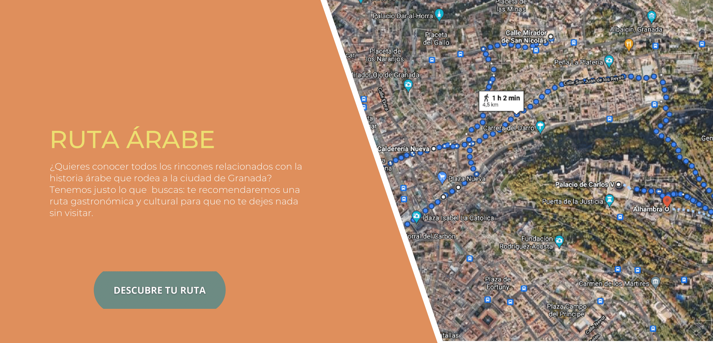

### Página 3
#### Posibilidades y ventajas de la oferta para los usuarios
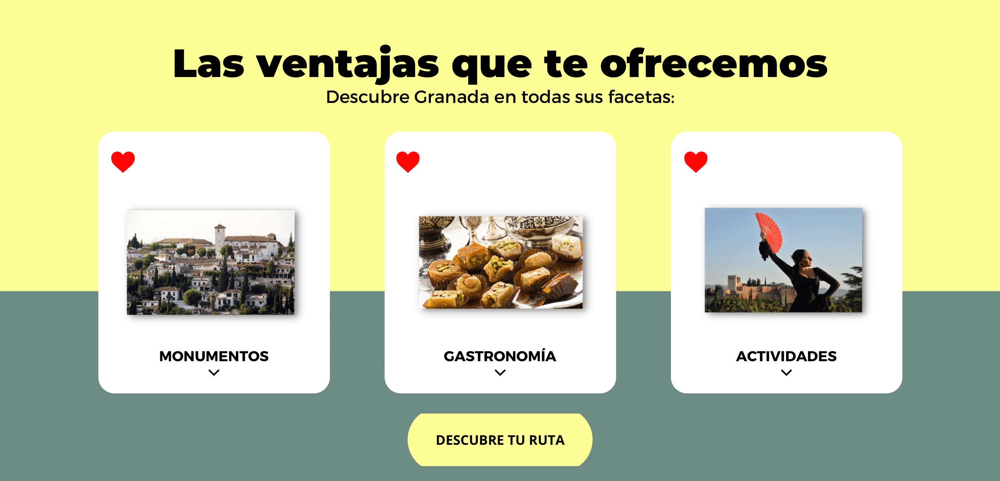

### Simulación

>>> Plantear Landing Page 

 3.c Guidelines
----

## Guía de estilo
### Paleta de colores
Se ha seleccionado la siguiente paleta de colores con el objetivo de estructurar y definir de forma excepcional el valor de la marca. La paleta está conformada por un conjunto monocromático, que define el valor de la propuesta, junto a un color complementario, que se utiliza para destacar elementos claves, y dos colores básicos, que dotan de sencillez.

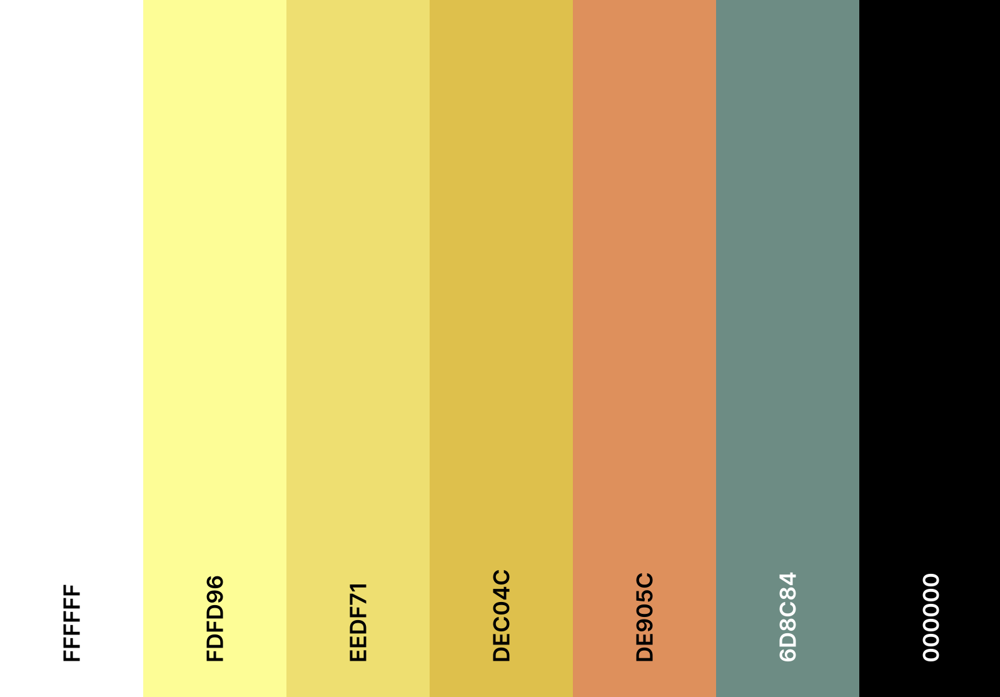

El ***amarillo***:
- En un tono **claro** (amarillo canario) representa elegancia, originalidad y alegría.
- En un tono **pálido** (amarillo paja) representa el deterioro y el paso del tiempo.
- En un tono **dorado** (amarillo oro) representa opulencia y riqueza.

El ***azul xanadu*** aporta un punto de contraste a la variedad de colores amarillos.

El ***naranja persa*** representa la cultura árabe, sus espacios y construcciones.

Por ello, los colores elegidos se han considerado adecuados para diseñar GranadaÁrabe, una aplicación que permite una inmersión total en la cultura musulmana a través de sus tradiciones y costumbres. Esta paleta representa la historia que se quiere enseñar a través la propuesta.

### Tipografía
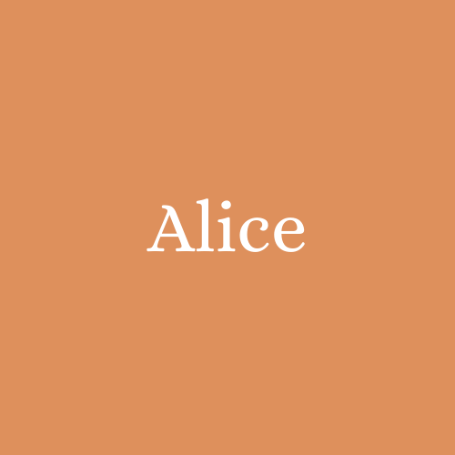

Guideline utilizado: **[Material Design](https://material.io/design)**, por ser el estándar para la mayoría de apps móviles que se desarrollan para Android hoy en día. Proporciona numerosos componentes y patrones de diseño que encajan perfectamente en nuestra app.

### Patrones de diseño

- Como se ha decidido utilizar una [App Bar](https://material.io/components/app-bars-top). No se muestra en la página de inicio puesto que en ella se simplifica el diseño para dar paso directamente al cálculo de la ruta.
- Para editar detalles en la página del usuario se utiliza un [Text Field](https://material.io/components/text-fields).
- Para pasar entre las 3 distintas partes de la ruta (monumentos, gastronomía y actividades) se utiliza el patrón [Tabs](https://material.io/components/tabs).
- Para seleccionar la parte de la aplicación que nos interesa (ruta, lista de todos los sitios e información general) se utiliza el patrón [Bottom Navigation Bar](https://material.io/components/bottom-navigation).
- Para disparar acciones en la app, tales como calcular la ruta, ver información concreta o acudir a un enlace externo, se utiliza el patrón [Buttons](https://material.io/components/buttons), con el tipo **Contained button**.
- Para visualizar información pasajera y que se superpone sobre la app se utiliza el patrón [Dialogs](https://www.material.io/components/dialog), con el tipo **Alert Dialog**.
- Para la lista de elementos en la ruta se utiliza el patrón [Lists](https://material.io/components/lists), con el tipo **Single-line List** ya que en la lista solo se visualiza el nombre del elemento, y si se quiere más información hay que pulsar sobre él.

  3.d Mockup
----

>>> Layout: Mockup / prototipo HTML  (que permita simular tareas con estilo de IU seleccionado)

 3.e ¿My UX-Case Study?
-----

>>> Publicar my Case Study en Github..
>>> Documente y resuma el diseño de su producto en forma de video de 90 segundos aprox

<!-- ## Paso 4. Evaluación 

 4.a Caso asignado
----

>>> Breve descripción del caso asignado con enlace a  su repositorio Github

 4.b User Testing
----

>>> Seleccione 4 personas ficticias. Exprese las ideas de posibles situaciones conflictivas de esa persona en las propuestas evaluadas. Asigne dos a Caso A y 2 al caso B

| Usuarios | Sexo/Edad     | Ocupación   |  Exp.TIC    | Personalidad | Plataforma | TestA/B
| ------------- | -------- | ----------- | ----------- | -----------  | ---------- | ----
| User1's name  | H / 18   | Estudiante  | Media       | Introvertido | Web.       | A 
| User2's name  | H / 18   | Estudiante  | Media       | Timido       | Web        | A 
| User3's name  | M / 35   | Abogado     | Baja        | Emocional    | móvil      | B 
| User4's name  | H / 18   | Estudiante  | Media       | Racional     | Web        | B 

. 4.c Cuestionario SUS
----

>>> Usaremos el **Cuestionario SUS** para valorar la satisfacción de cada usuario con el diseño (A/B) realizado. Para ello usamos la [hoja de cálculo](https://github.com/mgea/DIU19/blob/master/Cuestionario%20SUS%20DIU.xlsx) para calcular resultados sigiendo las pautas para usar la escala SUS e interpretar los resultados
http://usabilitygeek.com/how-to-use-the-system-usability-scale-sus-to-evaluate-the-usability-of-your-website/)
Para más información, consultar aquí sobre la [metodología SUS](https://cui.unige.ch/isi/icle-wiki/_media/ipm:test-suschapt.pdf)

>>> Adjuntar captura de imagen con los resultados + Valoración personal 

 4.d Usability Report
----

>> Añadir report de usabilidad para práctica B (la de los compañeros)

>>> Valoración personal 

## Paso 5. Evaluación de Accesibilidad  

  5.a Accesibility evaluation Report 
----

>>> Indica qué pretendes evaluar (de accesibilidad) sobre qué APP y qué resultados has obtenido 

>>> 5.a) Evaluación de la Accesibilidad (con simuladores o verificación de WACG) 
>>> 5.b) Uso de simuladores de accesibilidad 

>>> (uso de tabla de datos, indicar herramientas usadas) 

>>> 5.c Breve resumen del estudio de accesibilidad (de práctica 1) y puntos fuertes y de mejora de los criterios de accesibilidad de tu diseño propuesto en Práctica 4.

## Conclusión final / Valoración de las prácticas

>>> (90-150 palabras) Opinión del proceso de desarrollo de diseño siguiendo metodología UX y valoración (positiva /negativa) de los resultados obtenidos  -->
