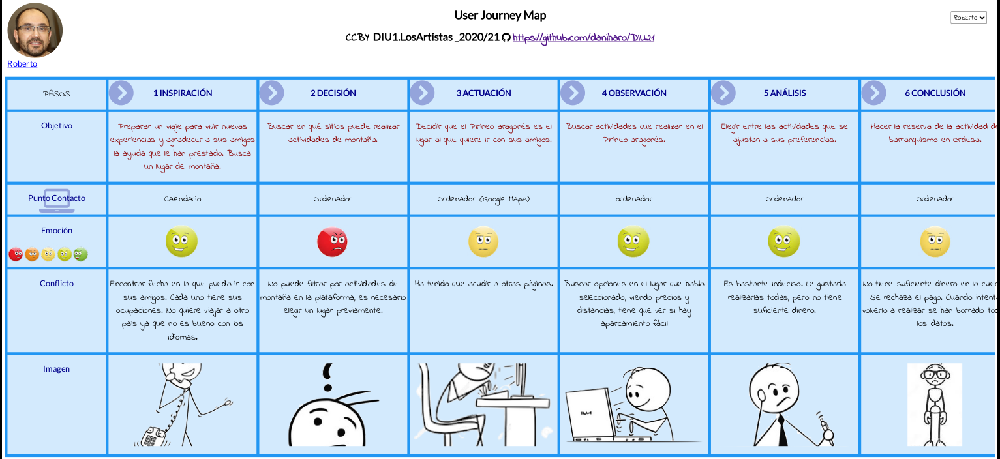

# DIU21
Prácticas Diseño Interfaces de Usuario 2020-21 (Tema: Turismo) 

Grupo: DIU3_LosArtistas.  Curso: 2020/21 
Updated: 9/3/2021

Proyecto: 
>>> Decida el nombre corto de su propuesta en la práctica 2 

Descripción: 

>>> Describa la idea de su producto en la práctica 2 

Logotipo: 
>>> Opcionalmente si diseña un logotipo para su producto en la práctica 3 pongalo aqui

Miembros
 * :bust_in_silhouette:   Ramón García Verjaga  
 * :bust_in_silhouette:   Daniel Haro Contreras

# Proceso de Diseño 

## Paso 1. UX Desk Research & Analisis 

 1.a Competitive Analysis
-----

 En relación a la asignación **DIU3 Experiencias y planificación de ocio**, hemos elegido los siguientes cuatro competidores que compararemos atendiendo a diferentes factores; entre ellos, la experiencia de usuario en los más diversos y frecuentes micro-momentos que pueden tener los usuarios en sus aventuras por las plataformas.
 - [Civitatis](https://www.civitatis.com/es/ "Civitatis"): Está centrada exclusivamente en las experiencias y planificación de ocio. Permite consultar y reservar diferentes experiencias en los lugares más turísticos del planeta. Es muy reconocida a nivel internacional y sirve de guía para muchos turistas ofreciendo diferentes itinerarios de visita en función de las necesidades de los mismos.
 - [TripAdvisor](https://www.tripadvisor.es/ "TripAdvisor"): No está centrada exclusivamente en las experiencias y planificación de ocio. Permite buscar alojamientos, restaurantes, vuelos, etc. Además, destaca por la comunidad tan grande que posee, que la hace una plataforma repleta de opiniones e hilos en foros que permiten encontrar casi cualquier opinión sobre diferentes restaurantes, hoteles, actividades, etc.
 - [Airbnb](https://www.airbnb.es/ "Airbnb"):  Está centrada principalmente en el alojamiento, razón por la que se expandió en sus comienzos. Sin embargo, ofrece tanto experiencias presenciales como experiencias online. Estas últimas surgen debido a la pandemia de COVID-19 con un aire renovador de adaptación. Se posiciona como la única plataforma en ofrecer experiencias online.
 - [Agenda cultural Junta de Andalucía](https://www.juntadeandalucia.es/cultura/agendaculturaldeandalucia/ "Agenda cultural Junta de Andalucía"): Está centrada exclusivamente en las experiencias y planificación de ocio. Permite conocer la mayor parte de los eventos culturales de Andalucía. Está dedicada a poner en valor el ocio regional y rural.
 
 Tabla de análisis comparativo que refleja algunas de las que hemos considerado principales características de las diferentes plataformas elegidas:

| | [Civitatis](https://www.civitatis.com/es/ "Civitatis") | [TripAdvisor](https://www.tripadvisor.es/ "TripAdvisor") | [Airbnb](https://www.airbnb.es/ "Airbnb") | [Agenda cultural Junta de Andalucía](https://www.juntadeandalucia.es/cultura/agendaculturaldeandalucia/ "Agenda cultural Junta de Andalucía") |
| ---- | ---- | ---- | ---- | ---- |
| Permite publicar experiencias | :heavy_check_mark: De forma comercial | :heavy_check_mark: De forma comercial | :heavy_check_mark: De forma comercial | :heavy_check_mark: De forma particular e institucional |
| Ofrece experiencias gratuitas | :heavy_check_mark: | :x: | :x: | :heavy_check_mark: |
| Ofrece experiencias en diversidad de sitios, no solo en los más turísticos | :x: | :x: | :x: | :heavy_check_mark: |
| Ofrece experiencias online | :x: | :x: | :heavy_check_mark: | :x: |
| Permite buscar experiencias | :heavy_check_mark: | :heavy_check_mark: | :heavy_check_mark: | :heavy_check_mark: |
| Permite filtrar experiencias por lugar | :heavy_check_mark: | :heavy_check_mark: | :heavy_check_mark: | :heavy_check_mark: |
| Permite filtrar experiencias por fecha | :heavy_check_mark: | :heavy_check_mark: | :heavy_check_mark: | :heavy_check_mark: |
| Permite filtrar experiencias por precio | :heavy_check_mark: | :heavy_check_mark: | :x: | :x: |
| Permite filtrar experiencias por accesibilidad | :heavy_check_mark: | :x: | :x: | :x: |
| Permite realizar la reserva de la experiencia | :heavy_check_mark: | :heavy_check_mark: | :heavy_check_mark: | :x: |
| Permite gestionar la reserva sin estar registrado | :heavy_check_mark: | :x: | :x: | :heavy_minus_sign: No procede |
| Permite que los usuarios publiquen opiniones sobre la experiencia | :heavy_check_mark: | :heavy_check_mark: | :heavy_check_mark: | :x: |
| Proporciona información sobre las restricciones por coronavirus en las experiencias | :heavy_check_mark: Mensaje genérico | :heavy_check_mark: Mensaje adaptado a cada experiencia | :x: | :heavy_check_mark: Depende del publicador de la experiencia |

 La plataforma que hemos elegido es [Civitatis](https://www.civitatis.com/es/ "Civitatis") por los siguientes motivos: es la plataforma que más se adapta a nuestro objetivo en los aspectos que hemos considerado importantes; ocupa la mayor cuota de mercado, es decir, es la más extendida entre los clientes; y tiene capacidad de adaptarse para cubrir experiencias que, a día de hoy, no cubre como, por ejemplo, experiencias y actividades en zonas no tan populares.

 1.b Persona
-----

 ## Roberto
 ### ¿Por qué hemos seleccionado a Roberto?
 Hemos seleccionado a Roberto por varios motivos:
 - No está familiarizado con las nuevas tecnologías.
 - Puede encontrar algunas dificultades a la hora de utilizar la plataforma.
 - Está interesado en aprender y vivir nuevas experiencias.

 ## Ana
 ### ¿Por qué hemos seleccionado a Ana?
 Hemos seleccionado a Ana por varios motivos:
 - Está acostumbrada a las nuevas tecnologías.
 - Sus exigencias en materia de interfaz de usuario son altas. Si no es lo suficientemente intuitiva, muy probablemente tardará poco en salirse del servicio.
 - En ella es muy importante la fase de “Soñar”: se le tiene que notificar debidamente de los posibles eventos de su gusto.

Por lo anterior, hemos llegado a la conclusión de que Roberto y Ana son usuarios que pueden aportarnos gran valor a la hora de realizar el análisis de la experiencia de usuario de la plataforma seleccionada.

 1.c User Journey Map
----

>>> Comenta brevemente porqué has escogido estas dos experiencias de usuario (y si consideras que son habituales) (80-150 caracteres) 

###  Journey Map de Roberto

###  Journey Map de Ana

 1.d Usability Review
----
>>>  Revisión de usabilidad: (toma los siguientes documentos de referncia y verifica puntos de verificación de  usabilidad
>>>> SE deben incluir claramente los siguientes elementos
>>> - Enlace al documento:  (sube a github el xls/pdf) 
>>> - Valoración final (numérica): 
>>> - Comentario sobre la valoración:  (60-120 caracteres)

## Paso 2. UX Design  

 2.a Feedback Capture Grid / EMpathy map / POV
----

>>> Comenta con un diagrama los aspectos más destacados a modo de conclusion de la práctica anterior,

 Interesante | Críticas     
| ------------- | -------
  Preguntas | Nuevas ideas
  
    
>>> ¿Que planteas como "propuesta de valor" para un nuevo diseño de aplicación para economia colaborativa ?
>>> Problema e hipótesis
>>>  Que planteas como "propuesta de valor" para un nuevo diseño de aplicación para economia colaborativa te
>>> (150-200 caracteres)

 2.b ScopeCanvas
----
>>> Propuesta de valor 

 2.b Tasks analysis 
-----

>>> Definir "User Map" y "Task Flow" ... 

 2.c IA: Sitemap + Labelling 
----

>>> Identificar términos para diálogo con usuario  

Término | Significado     
| ------------- | -------
  Login¿?  | acceder a plataforma

 2.d Wireframes
-----

>>> Plantear el  diseño del layout para Web/movil (organización y simulación ) 

## Paso 3. Mi UX-Case Study (diseño)

 3.a Moodboard
-----

>>> Plantear Diseño visual con una guía de estilos visual (moodboard) 
>>> Incluir Logotipo
>>> Si diseña un logotipo, explique la herramienta utilizada y la resolución empleada. ¿Puede usar esta imagen como cabecera de Twitter, por ejemplo, o necesita otra?

  3.b Landing Page
----

>>> Plantear Landing Page 

 3.c Guidelines
----

>>> Estudio de Guidelines y Patrones IU a usar 
>>> Tras documentarse, muestre las deciones tomadas sobre Patrones IU a usar para la fase siguiente de prototipado. 

  3.d Mockup
----

>>> Layout: Mockup / prototipo HTML  (que permita simular tareas con estilo de IU seleccionado)

 3.e ¿My UX-Case Study?
-----

>>> Publicar my Case Study en Github..
>>> Documente y resuma el diseño de su producto en forma de video de 90 segundos aprox

## Paso 4. Evaluación 

 4.a Caso asignado
----

>>> Breve descripción del caso asignado con enlace a  su repositorio Github

 4.b User Testing
----

>>> Seleccione 4 personas ficticias. Exprese las ideas de posibles situaciones conflictivas de esa persona en las propuestas evaluadas. Asigne dos a Caso A y 2 al caso B
 

| Usuarios | Sexo/Edad     | Ocupación   |  Exp.TIC    | Personalidad | Plataforma | TestA/B
| ------------- | -------- | ----------- | ----------- | -----------  | ---------- | ----
| User1's name  | H / 18   | Estudiante  | Media       | Introvertido | Web.       | A 
| User2's name  | H / 18   | Estudiante  | Media       | Timido       | Web        | A 
| User3's name  | M / 35   | Abogado     | Baja        | Emocional    | móvil      | B 
| User4's name  | H / 18   | Estudiante  | Media       | Racional     | Web        | B 

. 4.c Cuestionario SUS
----

>>> Usaremos el **Cuestionario SUS** para valorar la satisfacción de cada usuario con el diseño (A/B) realizado. Para ello usamos la [hoja de cálculo](https://github.com/mgea/DIU19/blob/master/Cuestionario%20SUS%20DIU.xlsx) para calcular resultados sigiendo las pautas para usar la escala SUS e interpretar los resultados
http://usabilitygeek.com/how-to-use-the-system-usability-scale-sus-to-evaluate-the-usability-of-your-website/)
Para más información, consultar aquí sobre la [metodología SUS](https://cui.unige.ch/isi/icle-wiki/_media/ipm:test-suschapt.pdf)

>>> Adjuntar captura de imagen con los resultados + Valoración personal 

 4.d Usability Report
----

>> Añadir report de usabilidad para práctica B (la de los compañeros)

>>> Valoración personal 

## Paso 5. Evaluación de Accesibilidad  

  5.a Accesibility evaluation Report 
----

>>> Indica qué pretendes evaluar (de accesibilidad) sobre qué APP y qué resultados has obtenido 

>>> 5.a) Evaluación de la Accesibilidad (con simuladores o verificación de WACG) 
>>> 5.b) Uso de simuladores de accesibilidad 

>>> (uso de tabla de datos, indicar herramientas usadas) 

>>> 5.c Breve resumen del estudio de accesibilidad (de práctica 1) y puntos fuertes y de mejora de los criterios de accesibilidad de tu diseño propuesto en Práctica 4.

## Conclusión final / Valoración de las prácticas

>>> (90-150 palabras) Opinión del proceso de desarrollo de diseño siguiendo metodología UX y valoración (positiva /negativa) de los resultados obtenidos  
